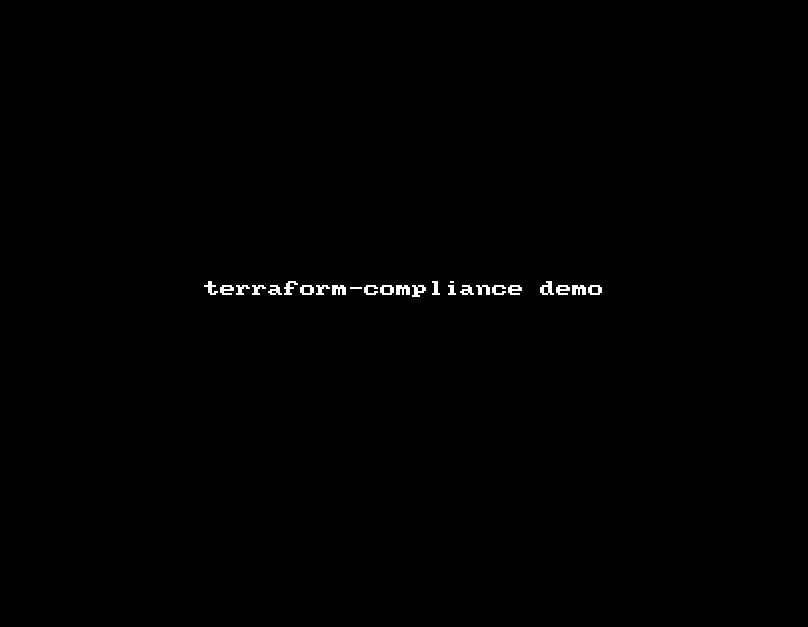

<h1 align="center">terraform-compliance</h1>

<div align="center">
  <strong>BDD Testing for Terraform Files</strong>
</div>
<div align="center">
  A lightweight BDD-testing Compliance Framework 
</div>

<br />

<div align="center">
  <!-- Build Status -->
  <a href="https://travis-ci.org/eerkunt/terraform-compliance">
    
  </a>
  
  <!-- Coverage -->
  <a href="https://coveralls.io/repos/github/eerkunt/terraform-compliance/">
    
  </a>
  
  
  <!-- Docker Ready -->
  <a href="https://hub.docker.com/r/eerkunt/terraform-compliance/">
    
  </a>

  <!-- License -->
  <a href="https://pypi.org/project/terraform-compliance/">
    
  </a>

  <!-- PyPI Version -->
  <a href="https://pypi.org/project/terraform-compliance/">
    
  </a>
</div>

## Table of Contents
- [Usage](#usage)
- [Features](#features)
- [BDD Directives](#BDD Directives)
- [Sample Test Set](#Examples)
- [FAQ](#faq)


## Quick Overview
- __compliance:__ Test your infrastructure as code before you deploy. Enforce your people to follow the policies.
- __behaviour driven development:__ We have BDD for nearly everything, why not for IaC ?
- __portable:__ just install it from `pip` or run it via `docker`
- __why ?:__ why not ?

## Usage

Recommended way to use `terraform-compliance` is using it's [Docker](https://hub.docker.com/r/eerkunt/terraform-compliance/) image.

Just define it as a function in your shell ;
```commandline
[~] $ function terraform-compliance { docker run --rm -v $(pwd):/target -i -t eerkunt/terraform-compliance "$@"; }
```
and use it whereever you want that has docker installed.

```commandline
[~] $ terraform-compliance --help
usage: terraform-compliance [-h] [--features feature_directory]
                            [--tfdir terraform_directory]

BDD Test Framework for Hashicorp terraform

optional arguments:
  -h, --help            show this help message and exit
  --features feature_directory, -f feature_directory
                        Directory consists of BDD features
  --tfdir terraform_directory, -t terraform_directory
                        Directory consists of Terraform Files
  --identity ssh_private_key, -i ssh_private_key
                        SSH Private key file used for GIT authentication
```

`terraform-compliance` is also available via `PyPi` package, so you can also install and use it via ;
```commandline
[~] $ pip install terraform-compliance
```

## Features

### Compliance Tests

The idea of `terraform-compliance` is to define compliance-as-code in BDD fashion where compliance against infrastructure-as-code
is defined in a human readable format which makes the life easier to understand what is being tested and failed/passed.

Ideally, the tools needs to be integrated with a CI/CD tool and runs on every build - where you can define the scope like
* Company wide compliance-as-code
* Project wide compliance-as-code

`terraform-compliance` does not require and infrastructure or credentials to run. It runs against HCL code, thus it is a
**PRE** compliance tool. In CI/CD pipeline it is recommended to be placed before you create the environment.

The demo shown below is a bit outdated, since lots of things change and tools has been improved substantially since 0.0.1 :)
The demo will be updated soon ;

```bash
[~] $ terraform-compliance -f example/example_01 -t example/tf_files
terraform-compliance v0.2.0 initiated
Features : /Users/sharky/Repository/terraform-compliance/example/example_01
Steps    : /Users/sharky/Repository/venv2/lib/python2.7/site-packages/terraform_compliance/steps
TF Files : /Users/sharky/Repository/terraform-compliance/example/tf_files
Validating terraform files.
All HCL files look good.
Running tests.
Feature: Security Groups should be used to protect services/instances  # /path/to/example/example_01/aws/security_groups.feature
    In order to improve security
    As engineers
    We'll use AWS Security Groups as a Perimeter Defence

    Scenario Outline: Policy Structure
        Given I define AWS Security Group
        Then it must contain <policy_name>

    Examples:
        | policy_name |
        | ingress     |
        | egress      |

    Scenario Outline: Well-known insecure protocol exposure on Public Network for ingress traffic
        Given I define AWS Security Group
        Then it must contain ingress
        with <proto> protocol and not port <portNumber> for 0.0.0.0/0

    Examples:
        | ProtocolName | proto | portNumber |
        | HTTP         | tcp   | 80         |
        | Telnet       | tcp   | 23         |
        | SSH          | tcp   | 22         |
        | MySQL        | tcp   | 3306       |
        | MSSQL        | tcp   | 1443       |
        | NetBIOS      | tcp   | 139        |
        | RDP          | tcp   | 3389       |

Feature: Subnets should be defined properly for network security  # /path/to/example/example_01/aws/subnets.feature
    In order to improve security
    And decrease impact radius
    As engineers
    We'll use a layered architecture in our AWS Environment

    Scenario: Subnet Count
        Given I define AWS Subnet
        When I count them
        Then I expect the result is more than 2
          AssertionError: 0 is not more than 2

2 features (1 passed, 1 failed)
10 scenarios (9 passed, 1 failed)
28 steps (27 passed, 1 failed)

[~] $ echo $?
1
[~] $
```

### BDD Directives
Every BDD feature file will have ;

- Feature
- Scenario/Scenario Outline
- Steps

##### Feature
This draws the overall picture of the feature file that may consist several scenarios.

For e.g. ;

```cucumber
Feature: Security Groups should be used to protect services/instances
  In order to improve security
  As engineers
  We'll use AWS Security Groups as a Perimeter Defence
```

This won't effect anything about the test steps, but it will ease the pain for everybody to understand what does that feature aims for.

##### Scenario
Every feature might have multiple scenarios. A scenario will define a test that might include multiple steps with BDD directives like ;

- GIVEN
- WHEN
- THEN

and every step might also have an additional extension step starting with ;
- AND

There are two types of Scenario ;

- Scenario : Used for defining a scenario without any multiple dynamic variables.
- Scenario Outline : Used for defining a scenario loops by giving multiple dynamic variables.

##### Steps
Steps are the functional tests that is actually executing necessary task to validate if the test is successful or not.

`terraform-compliance` has fixed steps already defined within the tool. It is possible to drill down your terraform resources by using these fixed steps.

###### Available Steps

| BDD Conditions | Step Sentence | Parameters | 
| ---------------| --------------| ---------- |
| GIVEN          | I have `{name}` `{type}` configured | `name`: name of the key in terraform (e.g. `aws_security_group`, `aws` ) <br>`type`: The type of the key (e.g. `resource`, `provider` etc.) |
| GIVEN          | I have `{resource_name}` defined | `name`: name of the resource ( e.g. `aws_security_group` ) |
| WHEN           | I `{math_formula}` them | `math_formula`: `sum` or `count` |
| THEN           | I expect the result is `{operator}` than `{number}` | `operator`: `more`, `more and equal`, `less`, `less and equal`<br>`number`: an integer |
| WHEN<br>THEN   | it contain `{something}`<br>it contains `{something}`<br>it must contain `{something}` | `something`: any property within terraform resoruce/provider/etc. (e.g. `access_key`, `ingress` ) |
| THEN           | encryption is enabled<br>encryption must be enabled | |
| THEN           | its value `{condition}` match the "`{search_regex}`" regex | `condition`: `must` or `must not`<br>`search_regex`: the regular expression of the searching value |
| WHEN<br>THEN   | its value must be set by a variable | |
| THEN           | it must `{condition}` have `{proto}` protocol and port `{port}` for `{cidr}` | `{condition}`: only,not<br>`proto`: tcp, udp<br>`port`: integer port number (or a port range by using `-` delimeter between port ranges [e.g. 80-84])<br>`cidr`: IP/Cidr |

Every condition can also be used to drill down more in the terraform code by utilising `AND` directive.

Any step consisting `GIVEN` and `WHEN` directives will lead to skip the whole scenario if one of those steps fails. `THEN` directive does not lead any scenario/step skipping, so if the step fails, whole scenario fails.

For e.g. ;
```cucumber
  Scenario: TLS enforcement on ELB resources
    Given I have AWS ELB resource defined
    When it contains listener
    Then it must contain ssl_certificate_id
```

To explain this, it is better to explain this by checking an example terraform code ;

```
resource "aws_elb" "some_elb" {
    name            = "My gorgeous ELB name"
    subnets         = "${var.subnet_ids}"
    security_groups = ["${aws_security_group.some_elb_sg.id}"]

    listener {
        instance_port      = 8084
        instance_protocol  = "https"
        lb_port            = 8084
        lb_protocol        = "https"
        ssl_certificate_id = "${module.acm-cert-elb.acm_cert_arn}"
    }
}
```
We are trying to create an AWS ELB Instance with SSL Certificates created from a module. 
The test steps will first run ;

```cucumber
Given I have AWS ELB resource defined
```
which will locate the resorce named `aws_elb` among all other resources ( please have a look [Naming Conventions](Naming Conventions) if you are not sure how `AWS ELB` transformed into `aws_elb` ) and then push the data to the step below ;

```cucumber
When it contains listener
```

Then it will drill down the `listener` definition within the HCL. If found, then the data within `listener` will be pushed on the next step.

*Till this point, if any of the steps fail, the further steps will be SKIPPED.*

For the last step ;
```cucumber
Then it must contain ssl_certificate_id
```
Here it will check within the data coming from the parent step if there is `ssl_certificate_id` defined within. This step is critical since it defines if the scenario will fail or pass.

###### Scenario Loops

It is also possible to use scenario loops. Please note that, `Scenario Outline` needs to be used instead of `Scenario`
.

```
Scenario Outline: Well-known insecure protocol exposure on Public Network for ingress traffic
    Given I have AWS Security Group defined
  	When it contains ingress
    Then it must not have <proto> protocol and port <portNumber> for 0.0.0.0/0

  Examples:
    | ProtocolName | proto | portNumber |
    | HTTP         | tcp   | 443       |
    | Telnet       | tcp   | 23         |
    | SSH          | tcp   | 22         |
    | MySQL        | tcp   | 3306       |
    | MSSQL        | tcp   | 1443       |
    | NetBIOS      | tcp   | 139        |
    | RDP          | tcp   | 3389       |
    | Jenkins Slave| tcp   | 50000      |
```


### Examples
Just as a sample to show the capabilities, `terraform-compliance` repository includes [a sample of tests](https://github.com/eerkunt/terraform-compliance/tree/master/example/example_01/aws).

These sample tests include ;

* Checks if encryption at rest is applied
* Checks if encryption in flight is applied
* Checks if naming standards are applied based on a specific format
* Checks if tagging is applied for applicable resources following the standards
* Checks if there are number of subnets defined in the terraform code for a multi-layered architecture
* Checks if there are some specific ports are not allowed for specific subnets in Security Groups
* Checks if API Keys/Credentials are not used within the code.

The tests can be easily extended with the current capabilities. For any new capability please raise [a new Issue](https://github.com/eerkunt/terraform-compliance/issues/new) and it will be implemented as soon as possible.

### Using git repositories
`terraform-compliance` also supports remote fetching if any of the feature or terraform files exist in a remote git repo. Sample usage is like ;

```commandline
[~] $ terraform-compliance -f git:https://some.git.repository/compliance-code.git -t /path/to/terraform_files
terraform-compliance v0.1.1 initiated
Using remote git repository: https://some.git.repository/compliance-code.git
Steps    : /Users/sharky/Repository/terraform-compliance/terraform_compliance/steps
Features : /var/folders/1k/7vm1m4p12db2tqbd5jcn004m0000gn/T/tmpsrlnAG (https://some.git.repository/compliance-code.git)
TF Files : /Users/sharky/Repository/terraform-compliance/example/tf_files
Validating terraform files.
All HCL files look good.
Running tests.
Feature: Resources should be encrypted  encryption_at_rest.feature
```

This is also applicable for terraform files ( `-t` argument ), too.

in case remote git repository is a private repo and requires authentication, you can invoke `-i` parameter to point
your private ssh-key to authenticate against target repository.
```commandline
[~] $ terraform-compliance -f /path/to/features -t git:ssh://fqdn/path/go/repo.git -i /path/to/private.key
```

If you already configured your `~/.ssh/config` and pointing remote host, and private key file, you don't even need to
use `-i` argument, it will be used automatically.


### Argument passing

You can also push additional arguments that is specific for `radish`. Just to explain how it works ;

For e.g.
```bash
[~] $ terraform-compliance -f /path/to/features -t /path/to/terraform_files -v
terraform-compliance v0.2.0 initiated
Features : /Users/sharky/Repository/terraform-compliance/example/example_01
Steps    : /Users/sharky/Repository/venv2/lib/python2.7/site-packages/terraform_compliance/steps
TF Files : /Users/sharky/Repository/terraform-compliance/example/tf_files
Validating terraform files.
All HCL files look good.
Running tests.
0.8.6
```
Please note that `0.8.6` is the `radish` version comes from `-v` parameter.

## FAQ

- __Q.__ Where are the steps defined ?
- __A.__ They all comes with `terraform-compliance`, you can just focus on BDD feature/scenario files.
<br /><br />
- __Q.__ What if I would like to add more steps ?
- __A.__ You are welcome to contribute on any test, or just add an issue it will be added.
<br /><br />
- __Q.__ Where should `terraform-compliance` run ?
- __A.__ Ideally in a CI/CD tool, where company policies are defined as feature files and all IaC is tested against. Trust, but verify.

## License
[MIT](https://tldrlegal.com/license/mit-license)
